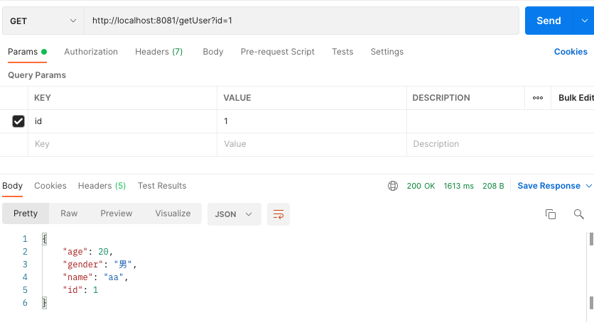

# Rpc-final
第三版rpc/zookeeper+springboot+netty/实现基本功能.</br>
访问/getUsers,客户端发起请求通过远程调用查询数据库信息。</br>
Tip：本项目没有将rpc-consumer和rpc-provider单独打成jar包后在其他项目测试，而是直接在rpc-client启用一个web服务作为测试。


## 结构介绍
* rpc-center: 结点注册过程相关的功能类。
  * 服务器节点的相关操作。如： 查找所有服务、更新服务节点信息、添加监听器、移除监听器
  * 定义一个接口，节点注册方法。
  * 对于服务端节点的监听操作，包括 节点的添加、节点的移除、节点的数据更新。
  * 实现服务端节点在Zookeeper中的注册
  * 对服务端节点的连接进行封装，包括ip,port
  * 定义Zookeeper连接所需的信息。
* rpc-api:
  * 对外暴露服务接口
  * 定义RpcRequest和RpcResponse,作为消息体。
  * 定义此次请求过程中所需要的实体类
* rpc-consumer: 服务消费者
  * 通过api消费远程暴露的rpc接口。
  * 对客户端与服务端的连接进行封装，定义相关的连接操作。
  * controller作为请求入口->创建代理对象->获取连接通道->发送请求到服务端->等待响应
* rpc-provider:服务提供者
  * 实现api中暴露的接口。
  * 启动服务->注册使用@RpcService的节点->等待客户端的连接->提供服务


配置文件格式
```
rpc:
  center:
    active: true
#zk节点
    connectStr: 47.96.43.26:2181
    sessionTimeoutMs: 50000
    connectionTimeoutMs: 50000
```


## 实现细节

### DataSourceManager
管理每个服务节点的连接池，初始时初始化一个空的连接池，并去寻找提供服务的节点，通过Netty建立一个长链接
为每个服务节点添加监听器，当服务节点存在变化时做出响应，完成**上下线的监控**功能。
定义接口LoadBalance，并存在两个实现类，通过返回不同的对象来确定**负载均衡的策略**。


### 线程安全
* 使用ConcurrentHashMap作为数据结构,存储服务节点和对应的连接资源。
* 由于查询居多，修改操作很少，因此使用CopyOnWriteArrayList作为数据结构，存储服务端与客户端的连接信息。
* 使用AtomicBoolean类型来确保连接是否已经添加监听。


### 负载均衡的实现
目前实现了两种策略：轮询和短工作优先。
#### 轮询策略
定义线程安全计数变量AtomicInteger,初始化为0，每次循环进行incrementAndGet(),使用andIncrement % connections().size()确定当前进行连接的服务端节点。
#### 短工作优先
自定义Comparator<Connection>,自定义ConnectStatus记录连接的响应时间和完成时间，重写compareTo()。初始状态或响应时间超过5s，会定义为空，优先选择。若状态都不会空，则选择响应时间最短的连接。


### 粘包问题
#### 服务端
```  serverBootstrap.group(bossGroup,workerGroup)
                       .channel(NioServerSocketChannel.class)
                       .childHandler(new ChannelInitializer<SocketChannel>() {
   
                           @Override
                           protected void initChannel(SocketChannel socketChannel) throws Exception {
                               ChannelPipeline pipeline = socketChannel.pipeline();
   
                               //网络字节通过$分割解决粘包问题`
                               ByteBuf byteBuf = Unpooled.copiedBuffer("$".getBytes(StandardCharsets.UTF_8));
                               pipeline.addLast(new DelimiterBasedFrameDecoder(2048,byteBuf));
                               //添加String的编码解码器
                               pipeline.addLast(new StringDecoder());
                               pipeline.addLast(new StringEncoder());
                               //业务处理类
                               pipeline.addLast(rpcServerHandler);
                           }
                       });
```
使用DelimiterBasedFrameDecoder,以分隔符作为码流结束标识的信息解码，分隔符是$。第一个参数2048表示到达该长度后仍然没有找到该分隔符，会抛出TooLongFrameException。防止异常码流缺失分隔符导致内存溢出。

 
 

